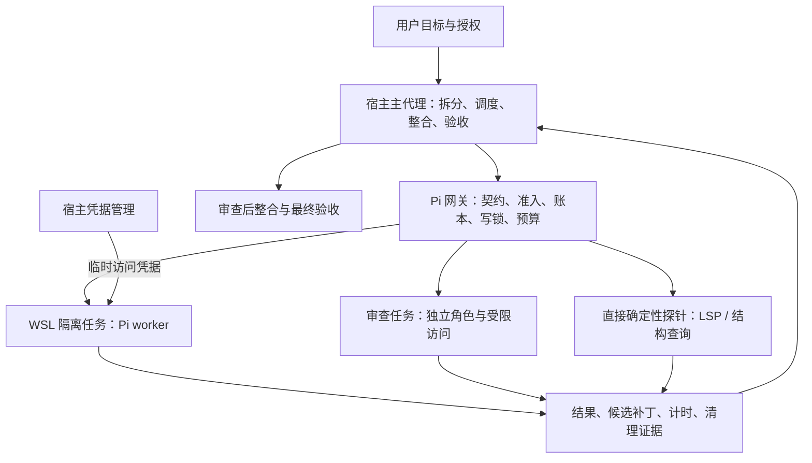

# YHWH 面试展示指南：AI Agent / AI 应用工程

准备基线：2026-09-22，v0.13.0 发布源码及当日本地服务定向升级记录。本文是展示与排练方案，不代表已完成演示录像、对照实验或所有客户端验收。本文作为文档包含在 v0.14.0 中。

## 1. 展示定位

建议标题：**YHWH：基于 Pi 的可控 Agent 执行与验收工作流**。

核心问题：模型能生成回答和补丁，但工程任务还需要明确权限、独立排队和执行预算、可靠的失败处理、可追溯结果与最终验收。YHWH 将这些要求组织到宿主规则、Pi 网关、隔离执行和证据检查中。

面试结束时，希望对方记住三点：

1. 你能把一个开放式 Agent 需求拆成可实现、可检验的系统边界。
2. 你会根据运行证据定位问题，不把“模型返回了内容”直接当成任务成功。
3. 你理解模型、确定性工具与人工决策各自适合承担的工作，并能解释成本和复杂度的取舍。

第一次出现角色时使用“主代理、执行代理、审查代理”。Kether 等内部名称放到附录映射表，避免面试官先记住一套陌生术语。模型具体名称只作为当前配置举例，设计重点是职责及边界。

## 2. 60 秒开场稿

> 我在使用 AI 辅助开发时，遇到的一个问题是：任务交给模型后，很难准确判断它是在思考、执行工具、等待资源，还是已经失败；即使返回了代码，也不能直接证明任务完成。
>
> 围绕这些问题，我主导设计并持续迭代了 YHWH。它基于 Pi 执行模型任务，让主代理负责拆分、调度和验收，让子代理交付受范围约束的实现，同时把代码诊断等确定性工作交给工具直接执行。
>
> 我重点处理了任务契约、资源与时间预算、幂等和并发写入约束、结果验证以及运行诊断。实现过程中使用了 AI 子代理编写代码和测试，我负责需求、设计取舍、审查、集成和实机验收。今天我会用一次真实的子代理超时，说明这个系统怎样从现象走到可验证的改进。

使用前逐句核对自己能解释的内容。“主导设计”应能由需求选择、方案取舍和验收记录支撑；对不能独立讲清楚的模块，说明它是上游能力或自己仍在深入理解的部分。

## 3. 12 分钟主讲：8 页即可

| 页 | 时间 | 页面内容 | 讲述重点 |
| --- | --- | --- | --- |
| 1. 场景与问题 | 1 分钟 | 一条真实任务及“等待、失败、验收不明”的问题 | 用户是谁、任务是什么、为什么需要工程控制 |
| 2. 职责与架构 | 1.5 分钟 | 下方架构图；标出宿主、Windows 网关、WSL 边界 | 谁做决策，谁执行，谁拥有凭据，谁能接受补丁 |
| 3. 一次任务如何完成 | 1.5 分钟 | 任务包→校验→准入→执行→结果→主代理验收 | 一个请求不是一个提示词字符串；成功也不是 exit code 0 |
| 4. 超时诊断案例 | 2 分钟 | 症状、计时证据、判断、改动、未证明事项 | 用实际数字说明定位过程，展示工程判断 |
| 5. 3 分钟演示 | 3 分钟 | 正常回显、一个确定性检查、一个约束拒绝案例 | 让对方看到输出、边界与验收，不只看界面动画 |
| 6. 三项设计取舍 | 1 分钟 | 模型/工具分工、单写者、按任务选思考深度 | 为什么这样做、付出了什么代价 |
| 7. 验证与当前限制 | 1 分钟 | 本地测试、CI、本机部署分列 | 证据范围，尚未完成的工程工作 |
| 8. 个人贡献与下一步 | 1 分钟 | 你的决策、AI 实现分工、优先级 | 贡献可归因；下一步有验收标准 |

如果只有 5 分钟：保留问题 30 秒、架构 60 秒、超时案例 90 秒、录屏或结果展示 60 秒、贡献与限制 60 秒。不要加速读完所有功能。

## 4. 架构图与讲解顺序

这是一张概念图，不表示所有路径都已完成独立实机验收。当前本机 reviewer 认证仍有问题；发布版与本机的 reviewer 认证适配也不同。

讲解三条边界：

- **职责边界**：主代理负责决策和验收；worker 交付候选实现。宿主规则不能从技术上禁用所有客户端编辑能力。
- **执行边界**：网关校验契约、权限和资源；WSL 沙箱限制任务。来自沙箱的补丁需要在宿主整合，不能宣称任意外部副作用都可以回滚。
- **证据边界**：结构化结果通过验证，只证明格式和必要条件满足；正确性仍需测试、审查及实际观察。

可补充：MCP 是接入协议，不能自动让所有客户端正确遵守工作流，也不会自动把远端客户端文件传到本机。

## 5. 主案例：为什么子代理迟迟交付不了

按“问题—证据—决策—验证—边界”讲，避免只按开发时间流水叙述。

**问题。** 编码任务多次超过预算，早期日志无法清楚区分模型思考、正文输出和工具执行。另一个历史任务在接近总截止时产生完成事件，却没有及时完成结果返回与清理。

**证据。** 一次 180 秒诊断任务记录了 83 个思考增量、0 个正文增量、0 个工具事件；认证约 225 ms，启动约 2165 ms，接近截止仍有思考活动。这支持“该次任务一直处于正文交付之前”的判断，不能据此断言所有超时都由模型推理导致。事件个数不是 token 数。

**决策。** 增加只含计数和时间的流诊断，保持原始思考和工具参数不被记录；将固定最高思考档位调整为按任务选档，默认 medium；缩小单任务交付范围；从原有总时限中扣除已消耗时间并预留收尾预算。

**实现要点。** 内部沙箱时间为 `floor(总秒数 - 已用毫秒/1000 - min(15, 总秒数×10%))`。用单调时钟计算已用时间，不把排队时限混进执行时限；预算不足一个完整秒时在启动前失败。软性提示的提前交付目标与运行时硬超时是两种不同约束。

**验证。** 本地升级后一次 60 秒预算的无工具调用在 14.961 秒完成，结果和清理均通过；返回 6 秒预留、53 秒沙箱预算，证明新逻辑进入实际执行链。

**边界。** 不能用此前的 180 秒复杂任务和这次 15 秒回显计算提速比。它们不是相同任务。尚无同任务对照实验支持整体速度、质量或 token 节省结论。

可展示的第二个小案例：本次升级的第一份 worker 提案虽然格式合法，却写错了导入路径和默认档位处理。主代理拒绝合入、缩小修正范围，第二份提案才通过。这能直接说明为什么“格式校验”和“语义验收”必须分开。

## 6. 三分钟演示脚本

以下是待排练方案，不表示本轮已运行这些演示。现场以预先录制的短片为后备，录制时间、版本和任务类型明确标注。

| 时间 | 操作 | 给面试官看的结果 | 所证明的内容 |
| --- | --- | --- | --- |
| 0:00–0:25 | 查看能力与健康状态 | 工作根目录、worker 路由、默认档位、就绪状态 | 展示的是实际服务配置 |
| 0:25–1:10 | 提交无文件、无工具的短任务 | 请求 ID、监控变化、最终结构化结果和 cleanup | 完整单任务路径；不证明编码能力 |
| 1:10–2:00 | 对演示副本中的一个已知类型错误运行直接 LSP | 明确 diagnostics、backend、modelCalls: 0 | 代码检查可通过确定性工具完成 |
| 2:00–2:40 | 展示已排练的越界写入拒绝测试或录屏 | 拒绝原因、原文件保持不变的证据 | 一个具体权限边界有效 |
| 2:40–3:00 | 展示验收小结 | 结果格式、模型路由、工具错误、清理、人工判断 | 接受完成的条件 |

准备要求：

- 使用一次性演示工作目录与合成数据。不要现场展示完整配置、认证文件或原始会话。
- LSP 先选一种已验证语言，提前验证对应语言服务器可用；不要现场下载依赖。
- 约束拒绝优先复用已有测试或准备好的录像。不要临场写真实项目文件来证明安全性。
- 主代理不循环查询进度。用独立刷新监控；在真实完成通知或预定截止点读取结果。当前没有通用完成等待接口，不能演成已经存在。
- 实机卡住时，用已有录像继续解释，不现场改认证、切模型或无限重试。
- 长任务、复杂编码、全新安装、Claude reviewer 登录、未验收的 Antigravity 路径留给问答或后续验证，避免成为现场演示的关键依赖。

## 7. 用三项取舍体现设计能力

| 决策 | 为什么采用 | 代价与适用边界 |
| --- | --- | --- |
| 确定性查询直接执行 | 避免让模型替代可以由语言服务器完成的查询，并独立于模型认证 | 语言服务器有启动、缓存和环境成本；单文件检查不等于全项目语义 |
| 默认单写者、限定写入范围 | 减少重叠补丁和整合歧义，便于复核 | 限制并行吞吐；只有任务真正独立时才值得并发 |
| 按任务选思考档位并保留总预算 | 避免所有任务默认最高档位；给完整交付留下时间 | 需要评估质量退化；档位不是精确 token 配额，尚无通用提速数据 |

可选深挖：幂等键避免不确定结果下盲目重放，但不能泛化成任意外部副作用的 exactly-once 保证；代码关系记忆提供包含和导入等关系及调用提及，不是完整调用图；Git 管理的长期知识强调来源与过期检查，不是向量 RAG 系统。

## 8. 证据页：数字必须附带场景

| 证据 | 可陈述的事实 | 不应扩大成 |
| --- | --- | --- |
| v0.13.0 本地隔离回归 | 同一实现源码 326/326 通过 | 所有环境测试全绿或生产可用 |
| 对应发布提交的 GitHub CI 归档 | 321/326，5 项认证持久化相关测试失败 | 最新远端状态已重新查验或问题已修复 |
| 本次本机适配验证 | 45/45 专项检查通过，来源为 38+4+3 | 另外增加 45 个全新测试或完整宿主回归 |
| 安装包检查 | 128 项一键安装检查通过 | 全新 Windows 联网安装、重启持久性已通过 |
| 本次实际调用 | 14.961 秒；无工具；格式与清理通过；预算字段正确 | 编码任务平均耗时或性能优化比例 |
| 重启验收 | 新进程/实例、端口、healthz、readyz、Tunnel 通过 | 长期稳定性 SLA |

这份指南使用的是本地保存的 CI 运行记录，未重新查询 GitHub。正式面试前应刷新一次远端状态，并把截图注明为对应提交的结果。

## 9. 个人贡献如何表达

将贡献分成三栏：

| 你的职责 | AI 辅助实现 | 上游基础 |
| --- | --- | --- |
| 需求定义、架构边界、角色分工、任务拆分、权限与预算选择、验收标准、发布部署决策 | Pi worker 编写候选代码、测试和修正；由主代理检查、整合和运行验证 | Pi 执行能力、模型服务、MCP、WSL/Bubblewrap、multilspy 与语言服务器 |

推荐回答：“这是我主导设计和集成、使用 AI 辅助实现的工程项目。我能解释每项关键决策，并用被拒绝的补丁、测试记录和运行证据说明如何控制交付质量。”

不使用“全部核心从零手写”“全自动无人干预”“完全替代 Cordis”等无法支撑的表述。早期演进依据归档整理，并无完整连续 Git 历史；展示历史时区分归档事实和提交记录。

面试官若要求代码深挖，选择自己真正读懂的三个位置：

- [执行预算辅助模块](../payload/pi-dispatch/extensions/execution-budget.js)：时钟、舍入、预留与失败条件。
- [执行阶段诊断](../payload/pi-dispatch/extensions/execution-timeline.js)：事件解析、字段含义、缺失值与隐私边界。
- [请求账本](../payload/pi-dispatch/extensions/request-ledger.js)或[准入调度](../payload/pi-dispatch/extensions/admission-scheduler.js)：根据准备程度二选一，解释状态转换和失败路径。

## 10. 高频追问与回答要点

| 问题 | 回答框架 |
| --- | --- |
| 为什么不直接使用一个现成 Agent？ | 先承认 Pi 提供了基础执行；你的目标是组织跨任务的控制、契约和验收。举出具体扩展，不笼统声称现成工具都缺失这些能力。 |
| 多代理一定更好吗？ | 不一定。拆分带来上下文、等待和整合成本；以可独立交付和验收为条件，默认单写者。 |
| 怎样定义成功？ | 终态、路由、格式、语义任务要求、必要测试、清理与主代理验收；其中结构验证只是一个环节。 |
| 如何处理超时？ | 区分排队、认证、启动、生成/工具、交付和清理；按请求 ID 对账，有限修复；不把重试当作恢复证明。 |
| 心跳证明模型活着吗？ | 网关监管心跳只证明本地监管器仍活动；最近模型进度是另一组时间戳，两者都不能保证最终交付。 |
| 幂等是不是保证只执行一次？ | 先限定账本和受控执行范围，再解释不确定状态与重放；不能扩大为所有外部系统副作用的严格一次性保证。 |
| 如何降低幻觉？ | 用确定性工具、结构契约、证据和审查减少未经验证的接受；不能保证消除幻觉，审查模型也可能失败。 |
| 为什么最高思考档位改为 medium？ | 一次诊断显示交付前长期活动；因此采取按任务选档和拆包策略。收益仍需同任务对照评估。 |
| 如何保证密钥安全？ | 说明宿主维护凭据、临时访问权限与文件访问边界；不要把一种加密存储方式说成能防住已控制宿主的攻击者。 |
| 项目已经生产可用吗？ | 定位为有发布包和实机验证的个人工程项目；说明 CI、干净安装、审查认证和长期评估的缺口。 |
| 全部代码是你写的吗？ | 准确说明 AI 辅助开发分工，再深入解释你能负责的设计、审查与验收决策。 |
| 下一个最重要的改进？ | 完成固定任务集的质量/时间/用量评估、解决 CI 环境差异，并设计真正的完成事件接口。根据岗位选其中一项深入。 |

## 11. 面试前准备顺序

1. **先做一页介绍和一张架构图。** 从一个真实任务切入，删去不能服务主线的功能枚举。
2. **准备 8 页讲稿。** 每页写一句结论、一个证据和一个边界；内部角色全名放附录。
3. **录制 2–3 分钟演示。** 保留可复查结果，去掉凭据、个人路径和无关项目内容。真正录制后再标记为完成。
4. **准备证据附件。** 脱敏测试摘要、一个成功结果、一个失败及修正记录、发布清单。`.test` 本地原件不直接整体分发。
5. **独立排练代码讲解。** 不依赖 AI，解释一次预算计算、一次拒绝路径和一个失败状态转换；讲不清楚就缩小展示范围。
6. **分别排练 5 分钟和 12 分钟。** 演示失败时也能用证据完成讲述；结尾留给对方选择深入模块。

后续评估方案（尚未执行）：选择一组固定的小型编码任务，锁定任务、依赖、模型版本和验收测试；比较 medium 与 max，记录最终验收成功率、超时率、端到端耗时、修复次数和可用 token 用量。将首次成功与修复后成功分开；区分冷启动与复用状态，平衡执行顺序。不仅报告成功任务的平均耗时，也记录失败成本。先用小规模试验检查设计，再决定是否扩大样本。

## 12. 来源与讲稿维护

- [架构开发历史](architecture-history.md)：来源、历史演进及时间证据边界。
- [v0.13.0 发布说明](release-notes-0.13.0.md)：发布功能与发布时的验证状态。
- [思考档位与预算](worker-budgets.md)、[交付诊断](worker-delivery-diagnostics.md)、[子代理心跳](subagent-heartbeat.md)：核心案例设计。
- [项目知识](project-memory.md)、[关系记忆](code-graph.md)：扩展问答；不要混淆支持范围。
- 本地证据：`.test/p1-delivery-diagnosis.md`、`.test/effort-full-tests.log`、`.test/release-013-ci-failed.log`、`.test/release-013-build.log`、`.test/local-pi-013-20260922/acceptance.md` 和 `smoke-result.json`。这些是准备讲稿的依据，未作为公开附件打包。

README 中仍有“交付诊断待发布”等滞后文案，早期项目知识也仍有 Luna/max 旧描述。面试讲稿使用指定版本的发布记录与本机验收记录，不把这些旧段落作为当前状态。本指南没有顺带修改上述文档。
